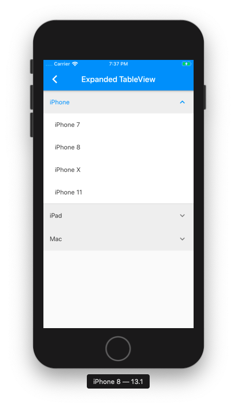
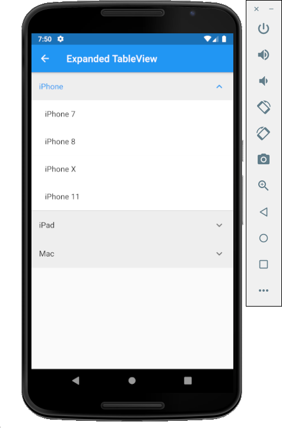

# Flutter-Examples

The goal of this project is to provide an ultimate collection of real world app's UIs. While I built Flutter UI for my own needs, it is also intented to showcase good app structure and a clean, well-organized Flutter codebase.

The source code is **100% Dart**, and everything resides in the [/lib] folder.

This project will try to **showcase most popular App Components and well-designed templates** that you will actually need and find useful.

## Getting Started

### Install flutter sdk

Please refer to flutter official document [Install](https://flutter.dev/docs/get-started/install).

### A few resources to get you started if this is your first Flutter project:

- [Lab: Write your first Flutter app](https://flutter.io/docs/get-started/codelab)
- [Cookbook: Useful Flutter samples](https://flutter.io/docs/cookbook)

## ScreenShots

### iOS  ||  android

    

    
